# DDD Context Mapping Mini-Project: Automotive Parts Manufacturing

**Domain:** Automotive Parts Manufacturing & Distribution  
**Enterprise Context:** Heavy SAP landscape (ERP, S/4HANA, SuccessFactors)  
**Difficulty:** Intermediate to Advanced  
**Time Estimate:** 4-6 hours for complete walkthrough

---

## Learning Objectives

By completing this project, you will be able to:

- Discover and classify subdomains from business requirements
- Identify Entities, Value Objects, and Aggregates with clear reasoning
- Define Bounded Contexts based on linguistic and team boundaries
- Apply context mapping patterns with trade-off awareness
- Make integration decisions (sync vs event-driven) based on failure modes
- Navigate brownfield constraints (legacy SAP, external partners)

---

## How to Use This Project

This project alternates between **teaching sections** and **exercises**. 

| Symbol | Meaning |
|--------|---------|
| 📖 | Concept explanation |
| ✏️ | Exercise (try before looking at hints) |
| 🔍 | Hint or partial solution |
| ✅ | Full solution (at end of document) |
| ⚠️ | Common mistake to avoid |
| 💡 | Pro tip from practice |

---

## Part 1: The Business Scenario

### 1.1 Company Profile

**AutoParts GmbH** manufactures brake systems, suspension components, and electronic control units (ECUs) for major OEMs (BMW, Mercedes, VW Group). 

**Current IT Landscape:**

```
┌─────────────────────────────────────────────────────────────┐
│                    EXISTING SYSTEMS                         │
├─────────────────────────────────────────────────────────────┤
│  SAP S/4HANA          │  Core ERP (Finance, MM, PP, SD)    │
│  SAP SuccessFactors   │  HR & Payroll                      │
│  SAP APO (Legacy)     │  Demand Planning (being replaced)  │
│  Siemens MES          │  Shop Floor Execution              │
│  Custom Portal        │  Supplier Collaboration (PHP/MySQL)│
│  EDI Gateway          │  OEM Order Integration             │
└─────────────────────────────────────────────────────────────┘
```

### 1.2 The Transformation Initiative

Management wants to build a **new platform** to handle:

1. **Quality Management** — Track defects, manage recalls, handle 8D reports
2. **Supplier Risk Scoring** — Evaluate supplier reliability beyond SAP vendor master
3. **Production Planning Optimization** — Replace SAP APO with modern ML-based planning
4. **Customer (OEM) Portal** — Real-time order visibility, quality certificates, delivery tracking
5. **Warranty Claims Processing** — Handle claims from OEMs, track root causes

**Your Role:** Lead architect responsible for domain modeling and context mapping.

---

## Part 2: Domain Discovery

### 📖 2.1 Concept: Event Storming (Condensed)

Before drawing boxes, we need to understand **what happens** in the business. Event Storming discovers:

- **Domain Events** — Things that happened (past tense): `OrderReceived`, `PartProduced`, `DefectDetected`
- **Commands** — Actions that trigger events: `PlaceOrder`, `InspectPart`, `RejectBatch`
- **Aggregates** — Clusters of objects that change together
- **Policies** — Automated reactions: "When X happens, do Y"
- **External Systems** — Things we don't control but must integrate with

### ✏️ Exercise 2.1: Identify Domain Events

Read these business scenarios and extract domain events.

**Scenario A: Quality Inspection**
> "When a batch of brake pads comes off the production line, a quality inspector scans the batch code and performs dimensional checks. If measurements are within tolerance, the batch is released to inventory. If not, it's quarantined and a defect report is created. Critical defects trigger an automatic supplier notification if the raw material was at fault."

**Your Events (fill in):**

```
1. ____________________
2. ____________________
3. ____________________
4. ____________________
5. ____________________
```

**Scenario B: OEM Order Fulfillment**
> "BMW sends orders via EDI daily at 6 AM. Orders reference a frame contract and specify part numbers, quantities, and required delivery dates. Our system validates against available inventory and production capacity. Confirmed orders trigger production scheduling. If we can't meet the date, we must send a counter-proposal within 4 hours or face penalties."

**Your Events (fill in):**

```
1. ____________________
2. ____________________
3. ____________________
4. ____________________
5. ____________________
```

<details>
<summary>🔍 Hint</summary>

Look for:
- State changes (something was created, updated, completed)
- External triggers (something arrived from outside)
- Decisions made (approved, rejected, confirmed)
- Time-based occurrences (deadline passed)

</details>

---

### 📖 2.2 Concept: Ubiquitous Language Conflicts

A critical DDD insight: **the same word means different things in different contexts**.

| Term | SAP Finance Meaning | Quality Team Meaning | Production Meaning |
|------|---------------------|----------------------|-------------------|
| "Batch" | Cost allocation unit | Inspection sample group | Production run |
| "Order" | Sales document (VA01) | Work instruction | Manufacturing order |
| "Material" | SKU with pricing | Physical substance properties | BOM component |
| "Supplier" | Vendor master record | Quality audit target | Delivery source |

⚠️ **Common Mistake:** Trying to create one universal "Supplier" entity that serves all contexts. This creates a bloated, change-resistant god object.

💡 **Pro Tip:** When you hear "but it's the same thing!" — dig deeper. Ask: "What decisions does each team make about this thing? What attributes matter to them?"

### ✏️ Exercise 2.2: Language Boundary Detection

Read these conversations and identify where language conflicts indicate context boundaries.

**Conversation 1:**
> **Quality Manager:** "We need to block Supplier X."  
> **Procurement:** "Block them? We have a 3-year contract!"  
> **Quality Manager:** "I mean block them from new quality audits until they resolve the open 8D."  
> **Procurement:** "Oh, that's different from payment block."

**Conversation 2:**
> **Production Planner:** "The order is late."  
> **Sales:** "No it isn't, the customer confirmed receipt."  
> **Production Planner:** "I mean the manufacturing order, not the sales order."

**What bounded contexts do these conflicts suggest?**

```
Conflict 1 suggests separation between: _____________ and _____________

Conflict 2 suggests separation between: _____________ and _____________
```

---

## Part 3: Subdomain Classification

### 📖 3.1 Concept: Core, Supporting, Generic

Not all parts of a domain deserve equal investment.

| Type | Definition | Investment Strategy | Examples |
|------|-----------|---------------------|----------|
| **Core** | What makes you competitively different | Build custom, invest heavily, protect IP | Unique algorithms, key workflows |
| **Supporting** | Necessary but not differentiating | Build simple or buy configurable | Standard business processes |
| **Generic** | Same across all companies | Buy off-the-shelf, outsource | Payroll, email, authentication |

### ✏️ Exercise 3.1: Classify Subdomains

For AutoParts GmbH, classify each capability. Mark C (Core), S (Supporting), or G (Generic).

| Capability | Your Classification | Reasoning (one sentence) |
|------------|---------------------|-------------------------|
| Production Planning Optimization | ___ | |
| Employee Payroll | ___ | |
| Quality Defect Tracking | ___ | |
| Supplier Risk Scoring | ___ | |
| General Ledger Accounting | ___ | |
| OEM Portal (Order Visibility) | ___ | |
| Warranty Root Cause Analysis | ___ | |
| User Authentication | ___ | |
| Inventory Counting | ___ | |
| Predictive Maintenance for Production Lines | ___ | |

<details>
<summary>🔍 Hint: Ask These Questions</summary>

- "If a competitor does this better, do we lose customers?" → Likely Core
- "Could we use the same solution as a hospital or bank?" → Likely Generic
- "Is this unique to automotive but not unique to *us*?" → Likely Supporting

</details>

---

### 📖 3.2 Concept: Subdomain vs Bounded Context

These are often confused.

| Subdomain | Bounded Context |
|-----------|-----------------|
| Problem space | Solution space |
| "What the business needs" | "How we model and build it" |
| Discovered from business | Designed by architects/teams |
| One subdomain → one or more BCs | One BC should serve one subdomain |

**Example:**  
- Subdomain: "Quality Management" (business need)
- Bounded Contexts: "Inspection Execution" (shop floor), "Quality Analytics" (reporting), "Supplier Quality" (audits)

Why split? Different change frequencies, different teams, different data freshness needs.

---

## Part 4: Tactical DDD — Building Blocks

### 📖 4.1 Concept: Entity vs Value Object

| Aspect | Entity | Value Object |
|--------|--------|--------------|
| Identity | Has unique ID, tracked over time | No ID, defined by attributes |
| Equality | Same ID = same entity | Same attributes = same value |
| Mutability | Can change state | Immutable (replace, don't modify) |
| Example | `Customer(id=12345)` | `Address(street, city, zip)` |

**The Test:** If two objects have the same attributes, are they the same thing?

- Two people named "John Smith" at same address → Still different people (Entities)
- Two addresses "123 Main St, Berlin" → Same address (Value Object)

### ✏️ Exercise 4.1: Entity or Value Object?

Classify each concept in the Quality Management context.

| Concept | E or V? | Reasoning |
|---------|---------|-----------|
| Defect Report | ___ | |
| Measurement Result (e.g., 12.5mm) | ___ | |
| Inspector (person performing check) | ___ | |
| Tolerance Range (min: 12.0, max: 13.0) | ___ | |
| Production Batch | ___ | |
| GPS Coordinates of Defect Location | ___ | |
| Supplier | ___ | |
| Defect Severity Level (Critical/Major/Minor) | ___ | |

---

### 📖 4.2 Concept: Aggregates

An Aggregate is a cluster of objects treated as a single unit for data changes.

**Rules:**
1. One entity is the **Aggregate Root** — all access goes through it
2. Objects inside can reference each other freely
3. Objects outside can only hold references to the root
4. The aggregate enforces its own invariants (business rules that must always be true)

**Example: Order Aggregate**

```
┌─────────────────────────────────────────┐
│            Order (Root)                 │
│  ┌─────────────┐  ┌─────────────┐       │
│  │ OrderLine 1 │  │ OrderLine 2 │       │
│  └─────────────┘  └─────────────┘       │
│  ┌─────────────────────────────┐        │
│  │ ShippingAddress (Value Obj) │        │
│  └─────────────────────────────┘        │
│                                         │
│  Invariant: Total ≤ Customer Credit     │
└─────────────────────────────────────────┘

External code can only call: order.addLine(), order.confirm()
Not: order.lines[0].changeQuantity() ← violates encapsulation
```

### ✏️ Exercise 4.2: Design an Aggregate

Design the **DefectReport** aggregate for Quality Management.

**Business Rules (Invariants):**
- A defect report must have at least one affected batch
- Critical defects must have a root cause assigned before closure
- Total affected quantity cannot exceed batch production quantity
- Once closed, no modifications allowed

**Your Design:**

```
┌─────────────────────────────────────────┐
│        _____________ (Root)             │
│                                         │
│  Entities inside:                       │
│  - _______________________              │
│  - _______________________              │
│                                         │
│  Value Objects inside:                  │
│  - _______________________              │
│  - _______________________              │
│  - _______________________              │
│                                         │
│  Key Methods on Root:                   │
│  - _______________________              │
│  - _______________________              │
│  - _______________________              │
│                                         │
└─────────────────────────────────────────┘
```

---

### 📖 4.3 Concept: Domain Events (Tactical)

Domain Events are facts about things that happened. They:

- Are named in past tense: `DefectReported`, not `ReportDefect`
- Are immutable (you can't change the past)
- Carry enough data for consumers to react without callbacks
- Enable loose coupling between aggregates and contexts

**Pattern: Event-Carried State Transfer**

Instead of:
```
Event: DefectReported { defectId: 123 }
Consumer: Must call back to get details
```

Prefer:
```
Event: DefectReported { 
  defectId: 123,
  batchId: "B-2024-001",
  severity: "CRITICAL",
  partNumber: "BP-4521",
  detectedAt: "2024-01-15T14:30:00Z"
}
Consumer: Has enough context to act
```

### ✏️ Exercise 4.3: Design Domain Events

Design events for these business scenarios.

**Scenario: Batch Released After Inspection**

```json
{
  "eventType": "_______________",
  "occurredAt": "...",
  "payload": {
    // What fields are needed?
    
  }
}
```

**Scenario: Supplier Blocked Due to Quality Issues**

```json
{
  "eventType": "_______________",
  "occurredAt": "...",
  "payload": {
    // What fields are needed?
    
  }
}
```

---

## Part 5: Bounded Context Definition

### 📖 5.1 Concept: Finding Context Boundaries

Good boundaries come from:

1. **Linguistic Boundaries** — Same word, different meanings
2. **Team Boundaries** — Who owns and changes this code?
3. **Change Frequency** — Things that change together stay together
4. **Consistency Requirements** — Strong consistency = same aggregate; eventual = different contexts
5. **Legacy System Boundaries** — SAP modules are often natural boundaries

⚠️ **Anti-pattern: "One BC Per Microservice"**  
Contexts are about business semantics, not deployment. One BC might have multiple services; one service shouldn't span multiple BCs.

### ✏️ Exercise 5.1: Draw Context Boundaries

Here are the discovered capabilities. Group them into bounded contexts.

**Capabilities:**
1. Inspect incoming materials
2. Score supplier reliability
3. Track supplier audit schedules
4. Generate quality certificates for OEMs
5. Process warranty claims
6. Analyze defect root causes
7. Plan production schedules
8. Execute shop floor work orders
9. Track OEM order status
10. Calculate supplier payment terms
11. Manage supplier contracts
12. Send defect notifications to suppliers

**Your Bounded Contexts:**

```
BC 1: _______________________
Contains: [capability numbers]
Reasoning: 


BC 2: _______________________
Contains: [capability numbers]
Reasoning: 


BC 3: _______________________
Contains: [capability numbers]
Reasoning: 


BC 4: _______________________
Contains: [capability numbers]
Reasoning: 


BC 5: _______________________
Contains: [capability numbers]
Reasoning: 

```

<details>
<summary>🔍 Hint: Grouping Questions</summary>

- Who needs real-time accuracy? (Same BC)
- What changes when regulations change? (Same BC)
- What can tolerate hours of delay? (Different BC, event-connected)
- What's already in SAP and not changing? (Likely ACL boundary)

</details>

---

## Part 6: Context Mapping

### 📖 6.1 Concept: Relationship Patterns

Context maps describe how BCs relate. The patterns encode **power dynamics** and **integration style**.

| Pattern | Relationship | Use When |
|---------|-------------|----------|
| **Shared Kernel** | Shared code/model owned jointly | Teams are tightly aligned, can release together (rare!) |
| **Customer–Supplier** | Upstream serves downstream's needs | Downstream has influence, upstream is responsive |
| **Conformist** | Downstream adopts upstream's model | No influence over upstream (e.g., SAP standard) |
| **Anti-Corruption Layer** | Downstream translates upstream's model | Protect your model from external complexity/instability |
| **Open Host Service** | Upstream provides standardized API | Multiple consumers, stable contracts |
| **Published Language** | Shared data format (often with OHS) | Industry standards, interchange formats |
| **Separate Ways** | No integration | Cost > benefit, contexts are independent |
| **Partnership** | Mutual dependency, coordinated success | Two teams succeed or fail together |

### 📖 6.2 Concept: Integration Strength & Mode

Beyond patterns, specify:

**Strength:**
- **Strong** — Change requires coordination, breaks are likely
- **Semi** — Can tolerate delay, partial failure acceptable
- **Weak** — Should never block core operations

**Mode:**
- **Sync** — Request/response, immediate
- **Event** — Async publish/subscribe
- **Hybrid** — Sync command, async outcome

### ✏️ Exercise 6.1: Fix the Wrong Context Map

This map has several problems. Identify and fix them.

```
WRONG CONTEXT MAP:

┌──────────────┐     Shared Kernel      ┌──────────────┐
│   Quality    │◄─────────────────────►│     SAP      │
│  Management  │                        │   S/4HANA    │
└──────────────┘                        └──────────────┘
       │                                       │
       │ Customer-Supplier                     │ Customer-Supplier
       ▼                                       ▼
┌──────────────┐                        ┌──────────────┐
│   Supplier   │     Conformist         │  Production  │
│    Portal    │◄───────────────────────│   Planning   │
└──────────────┘                        └──────────────┘
       │
       │ Partnership
       ▼
┌──────────────┐
│   External   │
│  Suppliers   │
└──────────────┘
```

**Problems Found:**

```
Problem 1: _____________________________________________
Why it's wrong: _______________________________________
Better pattern: _______________________________________

Problem 2: _____________________________________________
Why it's wrong: _______________________________________
Better pattern: _______________________________________

Problem 3: _____________________________________________
Why it's wrong: _______________________________________
Better pattern: _______________________________________

Problem 4: _____________________________________________
Why it's wrong: _______________________________________
Better pattern: _______________________________________
```

---

### ✏️ Exercise 6.2: Pattern Selection Matrix

For each relationship, select the appropriate pattern and justify.

| Upstream | Downstream | Candidates | Your Choice | Reasoning |
|----------|-----------|------------|-------------|-----------|
| SAP S/4HANA (Material Master) | Quality Management | Conformist, ACL, Customer-Supplier | | |
| Quality Management | OEM Portal | Customer-Supplier, OHS, Partnership | | |
| Supplier Risk Scoring | SAP Procurement | Customer-Supplier, ACL, Separate Ways | | |
| Production Planning | Shop Floor Execution (MES) | Partnership, Customer-Supplier, ACL | | |
| Quality Management | External Supplier Systems | OHS + Published Language, ACL, Conformist | | |

---

### ✏️ Exercise 6.3: Complete the Context Map

Fill in the missing patterns, strengths, and integration modes.

```
INCOMPLETE CONTEXT MAP:

┌─────────────────────────────────────────────────────────────────┐
│                         OEM SYSTEMS                             │
│                    (BMW, Mercedes, VW EDI)                      │
└─────────────────────────────────────────────────────────────────┘
                              │
                              │ Pattern: ____________
                              │ Strength: ___________
                              │ Mode: _______________
                              ▼
┌─────────────────────────────────────────────────────────────────┐
│                      OEM ORDER GATEWAY                          │
│              (EDI Translation, Order Validation)                │
└─────────────────────────────────────────────────────────────────┘
           │                                    │
           │ Pattern: ______                    │ Pattern: ______
           │ Strength: _____                    │ Strength: _____
           │ Mode: _________                    │ Mode: _________
           ▼                                    ▼
┌─────────────────────┐              ┌─────────────────────┐
│  PRODUCTION         │              │  OEM PORTAL         │
│  PLANNING           │              │  (Customer View)    │
│                     │              │                     │
└─────────────────────┘              └─────────────────────┘
           │
           │ Pattern: ____________
           │ Strength: ___________
           │ Mode: _______________
           ▼
┌─────────────────────────────────────────────────────────────────┐
│                       SAP S/4HANA                               │
│            (Inventory, BOM, Finance, Vendor Master)             │
└─────────────────────────────────────────────────────────────────┘
           │
           │ Pattern: ____________
           │ Strength: ___________
           │ Mode: _______________
           ▼
┌─────────────────────┐              ┌─────────────────────┐
│  QUALITY            │◄────────────►│  SUPPLIER RISK      │
│  MANAGEMENT         │   Pattern:   │  SCORING            │
│                     │   _________  │                     │
└─────────────────────┘              └─────────────────────┘
           │
           │ Pattern: ____________
           │ Strength: ___________
           │ Mode: _______________
           ▼
┌─────────────────────────────────────────────────────────────────┐
│                    SUPPLIER SYSTEMS                             │
│               (External, varying capabilities)                  │
└─────────────────────────────────────────────────────────────────┘
```

---

## Part 7: Integration Decisions

### 📖 7.1 Concept: Sync vs Event Decision Framework

| Factor | Favors Sync | Favors Event |
|--------|-------------|--------------|
| User waiting for response | ✓ | |
| Downstream can fail independently | | ✓ |
| Data freshness critical (seconds) | ✓ | |
| Multiple consumers | | ✓ |
| Long-running process | | ✓ |
| Strong consistency required | ✓ | |
| Upstream shouldn't know consumers | | ✓ |

### ✏️ Exercise 7.1: Integration Style Decisions

For each scenario, choose the integration style and explain.

**Scenario 1: Quality blocks a batch**
> When Quality Management quarantines a batch, SAP inventory must reflect this.

```
Style: [ ] Sync  [ ] Event  [ ] Hybrid
Reasoning: _______________________________________________
What happens if SAP is down? ______________________________
```

**Scenario 2: OEM requests order status**
> BMW's portal queries our system for real-time order status.

```
Style: [ ] Sync  [ ] Event  [ ] Hybrid
Reasoning: _______________________________________________
SLA implication: _________________________________________
```

**Scenario 3: Risk score affects supplier qualification**
> When Supplier Risk Scoring downgrades a supplier, Quality and Procurement need to know.

```
Style: [ ] Sync  [ ] Event  [ ] Hybrid
Reasoning: _______________________________________________
Why not sync? ____________________________________________
```

**Scenario 4: Production scheduling requests capacity**
> Production Planning needs to know current machine capacity from MES.

```
Style: [ ] Sync  [ ] Event  [ ] Hybrid
Reasoning: _______________________________________________
Trade-off acknowledged: ___________________________________
```

---

### 📖 7.2 Concept: The ACL in Practice

An Anti-Corruption Layer translates between models. It's code *you* write in *your* context.

```
┌─────────────────────────────────────────────────────────┐
│                  YOUR CONTEXT                           │
│                                                         │
│  ┌─────────────┐    ┌─────────────┐    ┌─────────────┐ │
│  │ Your Domain │◄───│    ACL      │◄───│  Adapter    │ │
│  │   Model     │    │ (Translator)│    │ (API Client)│ │
│  └─────────────┘    └─────────────┘    └─────────────┘ │
│                                               │         │
└───────────────────────────────────────────────│─────────┘
                                                │
                                                ▼
                                    ┌─────────────────────┐
                                    │   EXTERNAL SYSTEM   │
                                    │   (SAP, Supplier)   │
                                    └─────────────────────┘
```

**ACL Responsibilities:**
1. Translate external IDs to internal IDs
2. Map external terms to your ubiquitous language
3. Handle external model quirks (nulls, format differences)
4. Shield your domain from external schema changes

### ✏️ Exercise 7.2: Design an ACL

Design the ACL between Quality Management and SAP Material Master.

**SAP Material Master Data (MARA table simplified):**
```
MATNR: "000000000012345678"  (18-char padded)
MAKTX: "BRAKE PAD FRONT LH"
MEINS: "ST"                   (SAP unit code)
MTART: "FERT"                 (material type)
MATKL: "001"                  (material group)
```

**Your Quality Domain Model:**
```typescript
interface Part {
  partNumber: string;        // How you want it
  description: string;
  unitOfMeasure: UnitOfMeasure;  // Your enum
  partCategory: PartCategory;    // Your classification
}
```

**Your ACL Translation Code:**

```typescript
class SapMaterialAcl {
  
  translateToPart(sapMaterial: SapMaterialMaster): Part {
    return {
      partNumber: // How do you transform MATNR?
      
      description: // Any transformation needed?
      
      unitOfMeasure: // How do you map "ST", "KG", "L"?
      
      partCategory: // How do you map MTART?
      
    };
  }
  
  // What about the reverse direction (if needed)?
  
}
```

---

## Part 8: Brownfield Stress Test

### 📖 8.1 Concept: Incident-Driven Architecture Validation

A context map isn't just documentation — it should answer:
- What breaks when X fails?
- What can continue independently?
- Where are the blast radius boundaries?

### ✏️ Exercise 8.1: Incident Scenario Analysis

**Scenario: SAP S/4HANA Emergency Maintenance**

> Friday 5 PM: SAP announces 4-hour emergency maintenance starting in 30 minutes. 
> Production is running. OEM orders are arriving. Quality inspections are ongoing.

Using your context map, answer:

```
1. What processes MUST stop?
   ________________________________________________
   ________________________________________________

2. What processes CAN continue with degraded functionality?
   ________________________________________________
   ________________________________________________

3. What processes are completely unaffected?
   ________________________________________________
   ________________________________________________

4. What data might need reconciliation after SAP returns?
   ________________________________________________
   ________________________________________________

5. What pattern/decision enabled this resilience?
   ________________________________________________
```

---

### ✏️ Exercise 8.2: Design for Failure

A common failure mode: **Supplier Risk Scoring service becomes slow** (30-second response times instead of 200ms).

**Current Design (Problematic):**
```
Quality Inspection Flow:
1. Inspector scans batch
2. System calls Risk Scoring synchronously
3. System waits for risk score
4. System decides release/quarantine
5. Inspector sees result

Problem: Inspector waits 30+ seconds per batch
```

**Your Improved Design:**

```
Redesigned Flow:
1. 
2. 
3. 
4. 
5. 

Pattern used: _______________________

New states needed in Quality context:
- 
- 
- 

Events that replace sync call:
- 
- 
```

---

## Part 9: Full Context Map (Your Solution)

### ✏️ Exercise 9.1: Create the Complete Map

Using everything you've learned, create the full context map in Mermaid syntax.

**Requirements Checklist:**
- [ ] All bounded contexts identified
- [ ] Patterns labeled on each relationship
- [ ] Strength indicated (Strong/Semi/Weak)
- [ ] Integration mode specified (Sync/Event/Hybrid)
- [ ] SAP as external system with appropriate pattern
- [ ] OEM systems with appropriate pattern
- [ ] Supplier systems with appropriate pattern
- [ ] Legend included

```mermaid
flowchart TD
    %% YOUR SOLUTION HERE
    %% 
    %% Start with contexts...
    
    
    %% Add relationships with patterns...
    
    
    %% Add legend...
    
```

---

## Part 10: Solution Key

<details>
<summary>✅ Exercise 2.1 Solutions: Domain Events</summary>

**Scenario A: Quality Inspection**
1. `BatchScanned` — Inspector initiated check
2. `DimensionalCheckPerformed` — Measurements recorded
3. `BatchReleasedToInventory` — Passed inspection
4. `BatchQuarantined` — Failed inspection
5. `DefectReportCreated` — Documentation initiated
6. `SupplierNotifiedOfDefect` — External communication triggered

**Scenario B: OEM Order Fulfillment**
1. `OemOrderReceived` — EDI message arrived
2. `OrderValidatedAgainstContract` — Business rules checked
3. `InventoryAvailabilityChecked` — Stock verified
4. `OrderConfirmed` — Commitment made
5. `ProductionScheduleTriggered` — Planning initiated
6. `CounterProposalSent` — Alternative offered (if needed)
7. `OrderConfirmationDeadlinePassed` — Time-based event (penalty trigger)

</details>

<details>
<summary>✅ Exercise 2.2 Solutions: Language Boundaries</summary>

**Conflict 1:** Supplier Quality Management and Procurement/Finance
- "Block" means different things
- Quality: audit/qualification block
- Finance: payment block
- These are separate bounded contexts

**Conflict 2:** Production and Sales
- "Order" has different meanings
- Manufacturing Order (internal work)
- Sales Order (customer-facing commitment)
- Production Planning and Order Management are separate contexts

</details>

<details>
<summary>✅ Exercise 3.1 Solutions: Subdomain Classification</summary>

| Capability | Classification | Reasoning |
|------------|---------------|-----------|
| Production Planning Optimization | **C** (Core) | Differentiator — better planning = competitive advantage in delivery reliability |
| Employee Payroll | **G** (Generic) | Same for all companies, use SuccessFactors |
| Quality Defect Tracking | **C** (Core) | Automotive quality is a key differentiator for OEM trust |
| Supplier Risk Scoring | **C** (Core) | Unique algorithms based on your supplier relationships |
| General Ledger Accounting | **G** (Generic) | Standard SAP FI, no customization needed |
| OEM Portal | **S** (Supporting) | Necessary for business but not unique — all competitors offer similar |
| Warranty Root Cause Analysis | **C** (Core) | Deep domain expertise, competitive IP |
| User Authentication | **G** (Generic) | Use standard IdP |
| Inventory Counting | **S** (Supporting) | Necessary but standard process |
| Predictive Maintenance | **C** (Core) | ML-based optimization is differentiating capability |

</details>

<details>
<summary>✅ Exercise 4.1 Solutions: Entity vs Value Object</summary>

| Concept | E or V? | Reasoning |
|---------|---------|-----------|
| Defect Report | **E** | Has lifecycle, tracked by ID, changes state |
| Measurement Result | **V** | Just data (12.5mm is 12.5mm everywhere) |
| Inspector | **E** | Person with identity, tracked over time |
| Tolerance Range | **V** | Defined by min/max values, no identity |
| Production Batch | **E** | Tracked through lifecycle, has unique batch number |
| GPS Coordinates | **V** | Just location data, no identity |
| Supplier | **E** | Has identity, tracked relationship over time |
| Defect Severity Level | **V** | Enum/classification, defined by value |

</details>

<details>
<summary>✅ Exercise 4.2 Solution: DefectReport Aggregate</summary>

```
┌─────────────────────────────────────────────────────────┐
│            DefectReport (Root)                          │
│                                                         │
│  Entities inside:                                       │
│  - AffectedBatch (links to batch, tracks quantity)      │
│  - CorrectiveAction (tracked separately if complex)     │
│                                                         │
│  Value Objects inside:                                  │
│  - DefectSeverity (Critical/Major/Minor)                │
│  - RootCause (category + description)                   │
│  - DetectionPoint (where found: Incoming/InProcess/Final│
│  - ReportStatus (Open/Investigating/PendingAction/Closed│
│                                                         │
│  Key Methods on Root:                                   │
│  - addAffectedBatch(batch, quantity) — enforces limits  │
│  - assignRootCause(cause) — required for critical close │
│  - close() — validates all invariants before allowing   │
│  - reopen(reason) — audit trail for reopening           │
│                                                         │
│  Invariants enforced:                                   │
│  - At least one AffectedBatch                           │
│  - Critical severity → RootCause required before close  │
│  - Quantity ≤ Batch.productionQuantity                  │
│  - Closed status → immutable                            │
└─────────────────────────────────────────────────────────┘
```

</details>

<details>
<summary>✅ Exercise 4.3 Solution: Domain Events</summary>

**Batch Released:**
```json
{
  "eventType": "BatchReleasedToInventory",
  "occurredAt": "2024-01-15T14:35:00Z",
  "payload": {
    "batchId": "B-2024-00123",
    "partNumber": "BP-4521-LH",
    "quantity": 500,
    "inspectorId": "INS-042",
    "qualityCertificateId": "QC-2024-00456",
    "releaseType": "FULL",
    "storageLocation": "WH-01-A-15"
  }
}
```

**Supplier Blocked:**
```json
{
  "eventType": "SupplierQualityBlocked",
  "occurredAt": "2024-01-15T16:00:00Z",
  "payload": {
    "supplierId": "SUP-1234",
    "supplierName": "Acme Materials GmbH",
    "blockReason": "OPEN_8D_REPORT",
    "relatedDefectReportIds": ["DR-2024-00089", "DR-2024-00092"],
    "blockedScopes": ["NEW_ORDERS", "QUALITY_AUDITS"],
    "blockedBy": "QM-MANAGER-007",
    "expectedResolutionDate": "2024-02-01"
  }
}
```

</details>

<details>
<summary>✅ Exercise 5.1 Solution: Bounded Contexts</summary>

**BC 1: Quality Inspection**
Contains: [1, 4]
Reasoning: Real-time shop floor operations, same team, strong consistency needed between inspection and certificate generation.

**BC 2: Supplier Quality Management**
Contains: [2, 3, 12]
Reasoning: All about supplier quality relationship — scoring, audits, and notifications are tightly coupled. Different cadence from shop floor inspection.

**BC 3: Production Planning**
Contains: [7]
Reasoning: Optimization algorithms, different team (often OR/ML specialists), replaces SAP APO.

**BC 4: Shop Floor Execution**
Contains: [8]
Reasoning: Already exists (Siemens MES), real-time execution. Interface via ACL.

**BC 5: OEM Order Management**
Contains: [9]
Reasoning: Customer-facing, different SLAs, feeds portal and triggers planning.

**BC 6: Warranty & Claims**
Contains: [5, 6]
Reasoning: Post-sales process, different regulatory requirements (liability), often separate team.

**BC 7: Procurement** (remains in SAP)
Contains: [10, 11]
Reasoning: Tightly integrated with SAP MM/FI, not differentiating, conformist pattern.

</details>

<details>
<summary>✅ Exercise 6.1 Solution: Wrong Map Problems</summary>

**Problem 1:** Shared Kernel between Quality Management and SAP S/4HANA
Why wrong: You cannot have shared code ownership with SAP. SAP releases on their schedule. Shared Kernel implies joint governance — impossible with vendor software.
Better pattern: **Conformist** or **ACL** (depending on how much you need to protect your model)

**Problem 2:** Customer-Supplier between SAP and Production Planning
Why wrong: SAP is not a "supplier" that responds to your needs. You have no influence over SAP's roadmap. The relationship is one-way conformance.
Better pattern: **Conformist** (if using standard) or **ACL** (if translating heavily)

**Problem 3:** Conformist between Production Planning and Supplier Portal
Why wrong: Conformist means downstream adopts upstream's model without translation. But the Supplier Portal serves external suppliers who have their own models. Also, the direction seems wrong.
Better pattern: **OHS + Published Language** from Supplier Portal (it should expose a stable API to suppliers)

**Problem 4:** Partnership with External Suppliers
Why wrong: Partnership implies mutual dependency and coordinated releases. External suppliers are not part of your organization. You cannot coordinate releases with hundreds of external companies.
Better pattern: **OHS + Published Language** (you publish stable contracts) or **ACL** (when consuming their varied formats)

</details>

<details>
<summary>✅ Exercise 6.2 Solution: Pattern Selection Matrix</summary>

| Upstream | Downstream | Your Choice | Reasoning |
|----------|-----------|-------------|-----------|
| SAP S/4HANA | Quality Management | **ACL** | Quality has its own ubiquitous language. SAP material/batch structures need translation. Protects from SAP upgrades. |
| Quality Management | OEM Portal | **OHS** | Portal is one of many potential consumers. Quality should expose stable API, not customize per OEM. |
| Supplier Risk Scoring | SAP Procurement | **Separate Ways** or **Event + ACL** | Risk Scoring is new capability, SAP has existing vendor evaluation. Initially separate, later integrate via events if value proven. |
| Production Planning | MES | **Partnership** | Both teams must coordinate — Planning creates orders, MES executes. Failure in either affects the other. Different from Customer-Supplier because influence is mutual. |
| Quality Management | External Suppliers | **OHS + Published Language** | Use industry standard (VDA, IATF formats). Suppliers conform to your published API. |

</details>

<details>
<summary>✅ Exercise 6.3 Solution: Complete Context Map</summary>

```
OEM SYSTEMS → OEM ORDER GATEWAY
Pattern: ACL (OEM Gateway translates EDI formats)
Strength: Strong (orders are critical)
Mode: Sync (4-hour response SLA requires immediate processing)

OEM ORDER GATEWAY → PRODUCTION PLANNING
Pattern: Customer-Supplier
Strength: Strong
Mode: Event (OrderConfirmed triggers planning)

OEM ORDER GATEWAY → OEM PORTAL
Pattern: OHS
Strength: Semi
Mode: Event (status updates published)

PRODUCTION PLANNING → SAP S/4HANA
Pattern: ACL
Strength: Strong
Mode: Hybrid (sync for inventory queries, event for order creation)

SAP S/4HANA → QUALITY MANAGEMENT
Pattern: ACL
Strength: Strong
Mode: Sync (material master lookups) + Event (inventory updates)

QUALITY MANAGEMENT ↔ SUPPLIER RISK SCORING
Pattern: Partnership
Strength: Semi
Mode: Event (bidirectional — defects affect scores, scores affect qualification)

QUALITY MANAGEMENT → SUPPLIER SYSTEMS
Pattern: OHS + Published Language
Strength: Weak
Mode: Event (notifications, 8D requests via industry standard formats)
```

</details>

<details>
<summary>✅ Exercise 7.1 Solutions: Integration Style Decisions</summary>

**Scenario 1: Quality blocks a batch**
Style: **Event** (with compensation pattern)
Reasoning: Quality can't wait for SAP to confirm. Block immediately in Quality context, emit `BatchQuarantined` event. SAP updates eventually. If SAP fails, queue persists.
What happens if SAP is down? Quality continues working. SAP catches up when back. Reconciliation job checks mismatches.

**Scenario 2: OEM requests order status**
Style: **Sync**
Reasoning: User waiting for response. BMW portal expects immediate answer. However, we query a read model (not source systems) to ensure speed.
SLA implication: Must maintain low-latency read model, updated via events from source systems.

**Scenario 3: Risk score affects supplier qualification**
Style: **Event**
Reasoning: Multiple consumers (Quality, Procurement, Portal). No single consumer should block scoring. Eventual consistency is acceptable — qualification doesn't change every second.
Why not sync? If Quality system is down, should Risk scoring stop? No. Decoupled is correct.

**Scenario 4: Production scheduling requests capacity**
Style: **Hybrid**
Reasoning: Planning needs current snapshot (sync query), but shouldn't block on real-time updates. Query MES for capacity, accept that it's "as of 5 minutes ago." MES also emits events for major state changes.
Trade-off: Accept slightly stale data for availability. Real-time accuracy would require tighter coupling.

</details>

<details>
<summary>✅ Exercise 7.2 Solution: ACL Design</summary>

```typescript
class SapMaterialAcl {
  
  private unitMapping: Map<string, UnitOfMeasure> = new Map([
    ['ST', UnitOfMeasure.PIECE],
    ['KG', UnitOfMeasure.KILOGRAM],
    ['L', UnitOfMeasure.LITER],
    ['M', UnitOfMeasure.METER],
  ]);
  
  private categoryMapping: Map<string, PartCategory> = new Map([
    ['FERT', PartCategory.FINISHED_GOOD],
    ['HALB', PartCategory.SEMI_FINISHED],
    ['ROH', PartCategory.RAW_MATERIAL],
  ]);
  
  translateToPart(sapMaterial: SapMaterialMaster): Part {
    return {
      // Strip leading zeros, SAP uses 18-char padded format
      partNumber: sapMaterial.MATNR.replace(/^0+/, ''),
      
      // Usually clean, but trim whitespace
      description: sapMaterial.MAKTX.trim(),
      
      // Map SAP unit codes to our enum, default to PIECE if unknown
      unitOfMeasure: this.unitMapping.get(sapMaterial.MEINS) 
        ?? UnitOfMeasure.PIECE,
      
      // Map SAP material type to our classification
      partCategory: this.categoryMapping.get(sapMaterial.MTART) 
        ?? PartCategory.UNKNOWN,
    };
  }
  
  // Reverse translation (when sending to SAP)
  translateToSapMaterial(part: Part): Partial<SapMaterialMaster> {
    return {
      MATNR: part.partNumber.padStart(18, '0'),
      MAKTX: part.description.substring(0, 40), // SAP field limit
      MEINS: this.reverseUnitMapping(part.unitOfMeasure),
      MTART: this.reverseCategoryMapping(part.partCategory),
    };
  }
}
```

Key ACL responsibilities demonstrated:
- ID format translation (padded zeros)
- Enum mapping with defaults for unknown values
- Field length handling (SAP limits)
- Bidirectional translation capability

</details>

<details>
<summary>✅ Exercise 8.1 Solution: Incident Analysis</summary>

**1. What processes MUST stop?**
- Financial postings (GL entries, invoice creation)
- Inventory movements that require SAP booking
- Purchase order creation in SAP
- Any process that writes directly to SAP

**2. What CAN continue with degraded functionality?**
- Quality Inspection: Can inspect, release locally, queue SAP updates
- Production Planning: Can create plans, queue SAP orders
- OEM Portal: Can show cached status, queue new orders
- Supplier notifications: Can send emails, delay SAP vendor updates

**3. What processes are completely unaffected?**
- Supplier Risk Scoring: Doesn't need SAP for scoring algorithms
- Shop floor execution (MES): Runs independently
- External supplier communication: Email/EDI separate from SAP

**4. What data might need reconciliation?**
- Inventory levels (local release vs SAP stock)
- Batch status (quarantine flags)
- Order confirmations (sent to OEM vs SAP sales doc)

**5. What pattern/decision enabled this resilience?**
- **ACL** between contexts and SAP: Each context has local data model
- **Event-driven** integration: Queues persist when SAP is down
- **Explicit state machines**: PendingSync state tracks what needs reconciliation

</details>

<details>
<summary>✅ Exercise 8.2 Solution: Design for Failure</summary>

**Redesigned Flow:**
1. Inspector scans batch
2. System records inspection results locally (immediate)
3. System emits `InspectionCompleted` event
4. System checks cached risk score (last known good)
5. If score stale, batch enters `PendingRiskEvaluation` state
6. Risk service processes event asynchronously
7. Risk emits `RiskScoreUpdated` event
8. Quality context receives event, finalizes decision
9. Inspector sees result (immediate with cached, updated when fresh arrives)

**Pattern used:** Event-Carried State Transfer + Eventual Consistency

**New states in Quality context:**
- `InspectionComplete_PendingRisk` — Inspection done, waiting for fresh risk score
- `ReleasedWithCachedRisk` — Released using cached score (flagged for review)
- `HeldForManualReview` — Risk service unavailable, no cached score, human decides

**Events replacing sync call:**
- `InspectionCompleted` { batchId, results, requestedRiskEvaluation: true }
- `RiskEvaluationRequested` { batchId, supplierId, partNumber }
- `RiskScoreProvided` { batchId, score, evaluatedAt, confidence }
- `BatchReleaseDecided` { batchId, decision, riskBasis: 'FRESH' | 'CACHED' | 'MANUAL' }

```mermaid
flowchart TD
    %% ===========================================
    %% CONTEXT MAP: AutoParts GmbH
    %% Automotive Parts Manufacturing
    %% ===========================================

    %% ---- External Systems ----
    OEM["🏭 OEM Systems<br/>(BMW, Mercedes, VW)<br/>───────────<br/>External"]
    SUPPLIERS["�icing Supplier Systems<br/>(External Partners)<br/>───────────<br/>External, Varied"]
    
    %% ---- SAP Landscape ----
    SAP["📊 SAP S/4HANA<br/>(Finance, MM, SD, PP)<br/>───────────<br/>Enterprise Backbone"]
    SF["👥 SAP SuccessFactors<br/>(HR, Payroll)<br/>───────────<br/>Generic Subdomain"]
    
    %% ---- New Platform Contexts ----
    OGW["🔌 OEM Order Gateway<br/>(EDI Translation)<br/>───────────<br/>ACL / Integration"]
    PP["📈 Production Planning<br/>(Optimization Engine)<br/>───────────<br/>Core Subdomain"]
    QM["✅ Quality Management<br/>(Inspection, Defects)<br/>───────────<br/>Core Subdomain"]
    SRS["⚖️ Supplier Risk Scoring<br/>(ML-based Evaluation)<br/>───────────<br/>Core Subdomain"]
    SQM["📋 Supplier Quality Mgmt<br/>(Audits, 8D Process)<br/>───────────<br/>Core Subdomain"]
    WC["💰 Warranty & Claims<br/>(Post-Sales Process)<br/>───────────<br/>Supporting Subdomain"]
    PORTAL["🖥️ OEM Portal<br/>(Customer View)<br/>───────────<br/>Supporting Subdomain"]
    
    %% ---- Shop Floor ----
    MES["⚙️ Siemens MES<br/>(Shop Floor Execution)<br/>───────────<br/>External System"]

    %% ===========================================
    %% RELATIONSHIPS
    %% ===========================================
    
    %% OEM → Gateway (inbound)
    OEM -->|"[ACL] Strong | Sync<br/>EDI Orders, VDA Format"| OGW
    
    %% Gateway distributes
    OGW -->|"[C/S] Strong | Event<br/>OrderReceived, OrderConfirmed"| PP
    OGW -->|"[OHS] Semi | Event<br/>OrderStatus Published"| PORTAL
    
    %% Production Planning
    PP -->|"[ACL] Strong | Hybrid<br/>Inventory Query (sync)<br/>ProductionOrder (event)"| SAP
    PP <-->|"[Partnership] Strong | Hybrid<br/>Capacity Query (sync)<br/>Schedule Events (async)"| MES
    
    %% Quality Management
    SAP -->|"[ACL] Strong | Sync<br/>Material Master, Batch Data"| QM
    QM -->|"[C/S] Semi | Event<br/>BatchReleased, BatchQuarantined"| SAP
    QM -->|"[OHS] Weak | Event<br/>QualityCertificate Published"| PORTAL
    QM -->|"[Partnership] Semi | Event<br/>DefectReported ↔ ScoreUpdated"| SRS
    QM -->|"[C/S] Strong | Sync<br/>Defect Data for 8D"| SQM
    
    %% Supplier Quality Management
    SQM -->|"[OHS + PL] Weak | Event<br/>VDA 4.3 Format<br/>8D Requests, Audit Schedules"| SUPPLIERS
    SRS -->|"[C/S] Semi | Event<br/>SupplierScoreChanged"| SQM
    
    %% Warranty flows
    OEM -->|"[ACL] Semi | Event<br/>Warranty Claims (EDI)"| WC
    WC -->|"[C/S] Semi | Sync<br/>Root Cause Lookup"| QM
    WC -->|"[Conformist] Semi | Event<br/>Financial Postings"| SAP
    
    %% Portal aggregates
    QM -.->|"[OHS] Weak | Event<br/>Quality Metrics"| PORTAL
    PP -.->|"[OHS] Weak | Event<br/>Delivery ETAs"| PORTAL
    
    %% HR is separate
    SF -.->|"[Separate Ways]<br/>No Integration"| QM

    %% ===========================================
    %% LEGEND
    %% ===========================================
    subgraph LEGEND["Legend"]
        direction TB
        L1["[ACL] = Anti-Corruption Layer<br/>Translate external models"]
        L2["[C/S] = Customer–Supplier<br/>Downstream has influence"]
        L3["[OHS] = Open Host Service<br/>Stable published API"]
        L4["[PL] = Published Language<br/>Industry standard format"]
        L5["[Partnership] = Mutual dependency"]
        L6["[Conformist] = Adopt upstream model"]
        L7["[Separate Ways] = No integration"]
        L8["─────────────────────"]
        L9["Strong = Coordination on change"]
        L10["Semi = Tolerates delays"]
        L11["Weak = Never blocks core"]
        L12["─────────────────────"]
        L13["Sync = Request/Response"]
        L14["Event = Async Pub/Sub"]
        L15["Hybrid = Both patterns"]
    end

    %% ===========================================
    %% STYLING
    %% ===========================================
    classDef external fill:#6b4c9a,stroke:#4a3570,color:#fff
    classDef sap fill:#1661be,stroke:#0d4a8a,color:#fff
    classDef core fill:#2d7d46,stroke:#1d5c32,color:#fff
    classDef supporting fill:#b8860b,stroke:#8b6914,color:#fff
    classDef integration fill:#708090,stroke:#4a5568,color:#fff
    
    class OEM,SUPPLIERS,MES external
    class SAP,SF sap
    class PP,QM,SRS,SQM core
    class WC,PORTAL supporting
    class OGW integration
```

</details>

<details>
<summary>✅ Exercise 9.1 Solution: Complete Context Map</summary>



</details>

---

## Appendix A: Quick Reference Cards

### Relationship Patterns Cheat Sheet

| Pattern | When to Use | When NOT to Use |
|---------|-------------|-----------------|
| **Shared Kernel** | Same team, same release cycle, shared ownership | Different teams, vendor software, external partners |
| **Customer–Supplier** | Downstream has negotiating power | Downstream has zero influence |
| **Conformist** | Upstream won't change, model is acceptable | Need to protect your domain model |
| **ACL** | Must protect domain from external complexity | Over-engineering simple integrations |
| **OHS** | Multiple consumers, stable contracts needed | Single consumer, rapidly evolving API |
| **Published Language** | Industry standards exist (VDA, EDIFACT) | Internal-only communication |
| **Separate Ways** | Integration cost > benefit | Data is actually needed |
| **Partnership** | Mutual success dependency | One side can succeed alone |

### Integration Decision Flowchart

```
Is user waiting for response?
├── Yes → Is consistency critical?
│         ├── Yes → Sync
│         └── No → Sync query to read model (updated via events)
└── No → Can downstream fail independently?
          ├── Yes → Event
          └── No → Is it a command + outcome?
                    ├── Yes → Hybrid
                    └── No → Sync (but reconsider design)
```

---

## Appendix B: Further Reading

- **Book:** "Domain-Driven Design" by Eric Evans (The Blue Book) — Chapters 14-17
- **Book:** "Implementing Domain-Driven Design" by Vaughn Vernon — Chapter 4
- **Pattern:** Context Mapping patterns — https://github.com/ddd-crew/context-mapping
- **Standard:** VDA 4.3 (Automotive quality reporting standard)
- **Standard:** EDIFACT/VDA EDI formats for automotive orders

---

*This project was designed for iSAQB CPSA-A DDD module preparation. It emphasizes trade-off reasoning over pattern memorization.*
